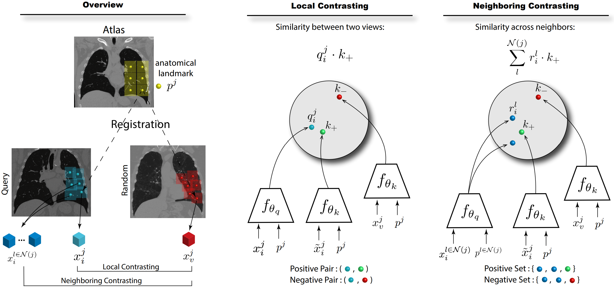

# DrasCLR: A Self-supervised Framework of Learning Disease-related and Anatomy-specific Representation for 3D Lung CT Images

Official PyTorch implementation for paper *DrasCLR: A Self-supervised Framework of Learning Disease-related and Anatomy-specific Representation for 3D Lung CT Images, accepted by Medical Image Analysis*.

<p align="center">
  
</p>

## Abstract
Large-scale volumetric medical images with annotation are rare, costly, and time prohibitive to acquire. Self-supervised learning (SSL) offers a promising pre-training and feature extraction solution for many downstream tasks, as it only uses unlabeled data. Recently, SSL methods based on instance discrimination have gained popularity in the medical imaging domain. However, SSL pre-trained encoders may use many clues in the image to discriminate an instance that are not necessarily *disease-related*. Moreover, pathological patterns are often subtle and heterogeneous, requiring the ability of the desired method to represent *anatomy-specific* features that are sensitive to abnormal changes in different body parts. In this work, we present a novel SSL framework, named DrasCLR, for 3D lung CT images to overcome these challenges. We propose two domain-specific contrastive learning strategies: one aims to capture subtle disease patterns inside a local anatomical region, and the other aims to represent severe disease patterns that span larger regions. We formulate the encoder using conditional hyper-parameterized network, in which the parameters are dependant on the anatomical location, to extract anatomically sensitive features. Extensive experiments on large-scale datasets of lung CT scans show that our method improves the performance of many downstream prediction and segmentation tasks. The patient-level representation improves the performance of the patient survival prediction task. We show how our method can detect emphysema subtypes via dense prediction. We demonstrate that fine-tuning the pre-trained model can significantly reduce annotation efforts without sacrificing emphysema detection accuracy. Our ablation study highlights the importance of incorporating anatomical context into the SSL framework.

#### [[Paper]](https://www.sciencedirect.com/science/article/pii/S1361841523003225) 
    @article{drasclr2023,
        title = {DrasCLR: A Self-supervised framework of learning disease-related and anatomy-specific representation for 3D lung CT images},
        journal = {Medical Image Analysis},
        pages = {103062},
        year = {2023},
        issn = {1361-8415},
        doi = {https://doi.org/10.1016/j.media.2023.103062},
        url = {https://www.sciencedirect.com/science/article/pii/S1361841523003225},
        author = {Ke Yu and Li Sun and Junxiang Chen and Max Reynolds and Tigmanshu Chaudhary and Kayhan Batmanghelich},
        keywords = {Self-supervised learning, Contrastive learning, Label-efficient learning, 3D Medical imaging data}
        }

### Requirements
- [PyTorch](https://pytorch.org/get-started/locally/)
- [SimpleITK](https://anaconda.org/SimpleITK/simpleitk)
- [easydict](https://anaconda.org/conda-forge/easydict)
- [monai](https://github.com/Project-MONAI/MONAI)
- [tensorboard\_logger](https://github.com/TeamHG-Memex/tensorboard_logger)
- [ANTs](http://stnava.github.io/ANTs/)
- [lungmask](https://github.com/JoHof/lungmask)

### Preprocess Data
Please follow the instructions [here](./preprocess/)

### Training
```bash
sh run_train.sh
```
The hyperparameter setting can be found in *run_train.sh*, we run the pre-training on 4 GPUs.

### Feature extraction
```
python extract_feature.py \
  --exp-name='./ssl_exp/exp_neighbor_2_128_expert_8' \
  --checkpoint-patch='checkpoint_patch_0002.pth.tar'
```
  
### Pretrained weights
<table><tbody>
<!-- START TABLE -->
<!-- TABLE HEADER -->
<th valign="bottom">Dataset</th>
<th valign="bottom">Anatomy</th>
<th valign="bottom">Checkpoint</th>
<!-- TABLE BODY -->
<tr><td align="left"><a href="https://www.ncbi.nlm.nih.gov/projects/gap/cgi-bin/study.cgi?study_id=phs000179.v6.p2">COPDGene</a></td>
<td align="center">Lung</td>
<td align="center"><a href="https://drive.google.com/file/d/1C3jUUfPZDmeufy3kcH_ShdTSknFs0bih/view?usp=sharing">Download</a></td>
</tr>
  
</tbody></table>

### Reference
MoCo v2: https://github.com/facebookresearch/moco
Context-aware SSL: https://github.com/batmanlab/Context_Aware_SSL